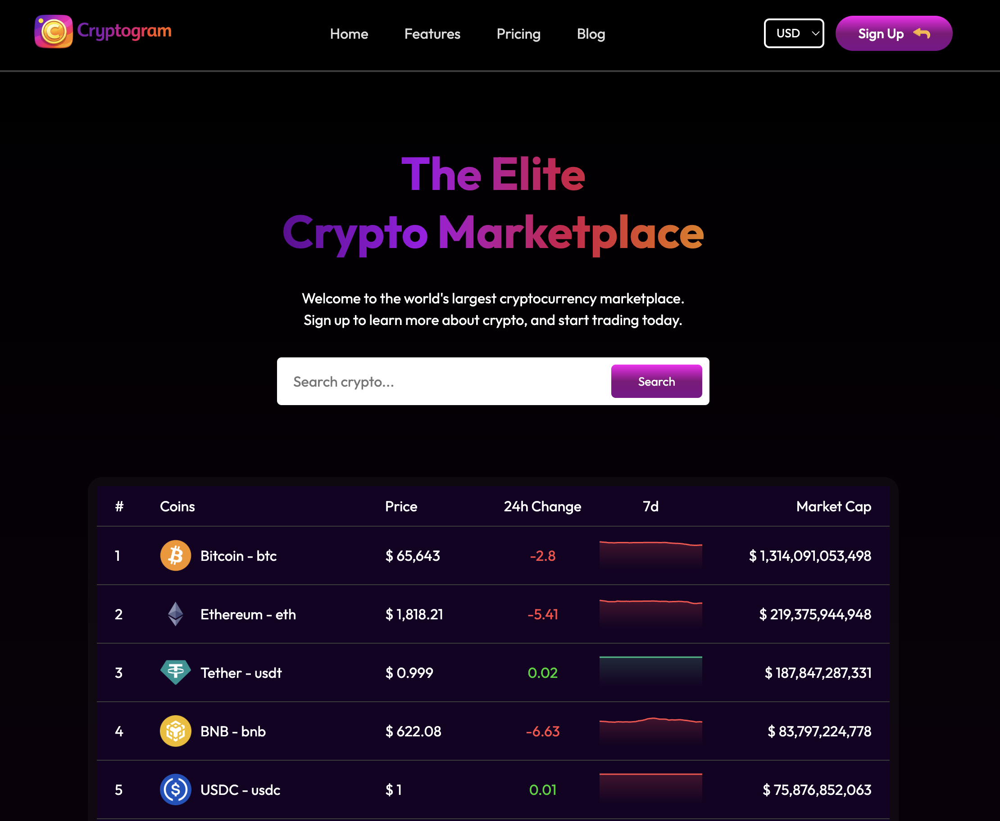

# Cryptogram


> A real-time cryptocurrency dashboard that tracks live prices, market data, and historical trends across hundreds of coins, powered by the CoinGecko API.

**[→ Live Demo](https://cryptogram-six.vercel.app/)**



---

## What It Does

Cryptogram pulls live market data from the CoinGecko API and presents it in a browsable dashboard. Users can view a ranked list of coins with current price, market cap, and 24-hour movement, switch the display currency, drill into an individual coin for detailed stats, and read price history through interactive charts and inline sparklines.

## Features

- **Live market data** — coin rankings, prices, and market caps fetched in real time from CoinGecko.
- **Currency switching** — toggle the displayed fiat currency; all values update to match.
- **Per-coin detail pages** — dedicated view for each coin with expanded statistics and a full price chart.
- **Inline sparklines** — compact trend charts on the coin list, color-coded green or red based on whether the coin is up or down over the sampled window.
- **Interactive charts** — historical price visualization built with Recharts, including a modal chart view.
- **Loading states** — skeleton placeholders while data is in flight, for a smooth perceived load.

## Tech Stack

- **React 19** — UI with hooks and the Context API for shared coin/currency state
- **Vite 7** — build tooling and dev server
- **React Router 7** — client-side routing between the home dashboard and coin detail pages
- **Recharts** — line charts and sparkline visualizations
- **react-loading-skeleton** — loading placeholders
- **CoinGecko API** — live cryptocurrency market data
- **Vitest** + **Testing Library** — unit testing
- **GitHub Pages** — deployment

## Testing

Pure data-transformation logic is unit-tested with Vitest. The sparkline helpers — downsampling a price series to a clean set of points (always preserving the most recent price) and determining whether a coin's trend is positive — are covered with tests for their core cases and boundaries.

```bash
npm test
```

The same suite runs in CI on every push and pull request (see the badge above).

## Running Locally

```bash
git clone https://github.com/markwaldron7string/cryptogram
cd cryptogram
npm install
```

Create a `.env` file in the project root with your CoinGecko API key:

```
VITE_COINGECKO_KEY=your-key-here
```

Then start the dev server:

```bash
npm run dev
```

Open [http://localhost:5173](http://localhost:5173).

> **Note:** The CoinGecko key is read at build time via `import.meta.env`. Because this is a client-side app, treat the key as a public, rate-limited demo key rather than a secret — it is bundled into the deployed front-end. The `.env` file is gitignored to keep it out of source control.

## Available Scripts

- `npm run dev` — start the Vite dev server
- `npm run build` — production build
- `npm run preview` — preview the production build locally
- `npm test` — run the Vitest suite once
- `npm run lint` — run ESLint

## License

Private portfolio project.
